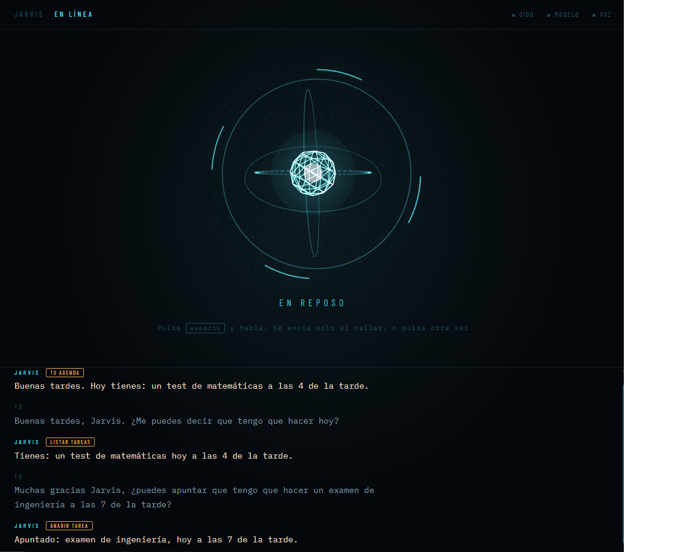
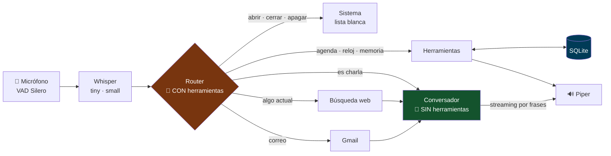

<h1 align="center">🎙️ Jarvis</h1>

<p align="center">
  <strong>Asistente de voz en español que corre entero en tu GPU.</strong><br>
  Habla, entiende, decide y actúa — agenda, Gmail y control del PC — sin una sola clave de API.
</p>

<p align="center">
  <a href="https://github.com/Totti-Coder/jarvis-local/actions/workflows/tests.yml">
    </a>
  <a href="LICENSE"></a>
</p>

<p align="center">
  
  
  
  
</p>

<p align="center">
  
  
  
  
  
  
  
  
</p>

---

## 🎬 Demo

<p align="center">
  
</p>

> [!NOTE]
> **Sustituir por un GIF de 15–20 s**: pulsar espacio → hablar → el anillo
> reacciona al espectro → respuesta hablada → popup del correo.
> Es lo primero que mira quien entra al repositorio.

```
Tú     ▸ "Recuérdame sacar la basura mañana a las ocho y media"
Jarvis ▸ "Apuntado: sacar la basura, mañana a las 8 y media de la mañana."

Tú     ▸ "¿Qué tengo el fin de semana?"
Jarvis ▸ "El fin de semana tienes: cena con Ana el viernes a las 9."

Tú     ▸ "Manda un correo formal a Ana pidiéndole que venga el jueves"
Jarvis ▸ "Te lo he preparado. Míralo y dime si lo mando."   → popup editable
```

---

## ⚡ Arquitectura: 4 etapas independientes, no un modelo end-to-end

Cada pieza se mide, se sustituye y se depura por separado. Latencias medianas
medidas en caliente sobre una RTX 3060 Ti.

| Etapa | Tecnología | Latencia | Por qué esta y no otra |
|:---|:---|:---:|:---|
| **1. Transcripción** | `faster-whisper` · `tiny` + `small` | **0,29 s** | Dos modelos: `tiny` para el texto en vivo cada 900 ms, `small` con `beam_size=5` para la pasada buena. Un solo modelo obliga a elegir entre fluidez y precisión |
| **2. Enrutado** | `llama3.1:8b` vía Ollama · *tool calling* | **0,47 s** | Modelo **sin** razonamiento explícito: Qwen3 volcaba 3.256 caracteres de *chain-of-thought* en `content` y tardaba 32,5 s al primer token |
| **3. Generación** | `llama3.1:8b` · **prompt distinto, sin herramientas** | **0,25 s** | Streaming por frases: empieza a hablar en cuanto cierra la primera, no espera al párrafo |
| **4. Voz** | `Piper` · `es_ES-sharvard-medium` | ×19 RT | Voz neuronal local. `pyttsx3` solo sonaba en 1 de cada 5 frases; SAPI funcionaba pero suena a robot de hace veinte años |
| **Estado** | `SQLite` + espejo en Google Calendar | — | Lo que debe ser exacto no lo guarda un modelo. Calendar es una copia *best-effort*: si Google cae, apuntar la compra sigue funcionando |



---

## 🧠 Engineering Highlights

Los cinco problemas que costaron de verdad. Cada decisión viene de una
medición, no de una intuición.

- **🔀 Dual-Prompt Router** — Enchufar las herramientas al asistente principal
  **rompe la conversación**: contestaba *"no tengo una función específica para
  contar chistes"*. Tres intentos de arreglarlo por prompt fracasaron. Se
  resolvió por arquitectura: **dos llamadas al LLM con personalidades
  distintas**, y el conversador no ve una herramienta jamás. Resultado: **97/97
  frases enrutadas** y conversación intacta.

- **🛡️ Deterministic Guardrails — *el modelo propone, el código dispone*** —
  ~10 filtros deterministas entre lo que propone el LLM y lo que se ejecuta.
  Cazan cosas reales: *"el PC se calienta mucho"* proponía subir el volumen;
  *"va muy lento"*, reiniciar; un *"sí"* suelto llegó a cerrar un programa. El
  modelo elige **qué función llamar**; la fecha, la hora y el texto los calcula
  código determinista y se guardan literales.

- **💉 Anti-Prompt-Injection en el correo** — Un correo entrante lo escribe
  cualquiera, y Jarvis tiene herramientas para mandar correos y apagar el PC.
  La defensa no es pedirle al modelo que no obedezca: **el contenido de un
  correo nunca llega a la llamada que lleva las herramientas conectadas**. Va
  solo al conversador, que no tiene ninguna. Aunque el modelo se creyera la
  orden, no hay con qué ejecutarla.

- **⚙️ El bug que costaba 14×** — Las dos llamadas usaban `num_ctx` distinto.
  Ollama **recargaba el modelo entero en cada turno**: 17,3 s por pregunta
  contra 1,2 s. Un solo parámetro.

- **📊 Espectro FFT, no volumen** — El anillo reacciona a 32 bandas
  logarítmicas por FFT, 20 veces por segundo. En escala lineal era inservible
  (ruido de fondo 0,62 vs voz alta 0,65); en dB, 0,00 vs 0,29.

<details>
<summary><b>➕ Más decisiones documentadas</b> — intérprete de fechas propio, VRAM, streaming, CUDA</summary>

<br>

**Por qué un intérprete de fechas propio y no `dateparser`.** "Mañana a las
8.40" es ambiguo: ¿mañana el día, o mañana la franja horaria? ¿8:40 o 20:40?
`dateparser` acierta el formato, no la intención. El intérprete propio resuelve
con el reloj: si son las 20:15 y dices "a las 8.40", quieres decir dentro de 25
minutos, no dentro de 12 horas. **82 casos de test** solo sobre esto.

**Por qué el resultado de una herramienta no pasa por el modelo.** Lo que
devuelve SQLite ya viene redactado y se lee tal cual. Si el modelo lo
reformulara, una hora podría cambiar por el camino. Es la diferencia entre un
asistente y una anécdota.

**`cublas64_12.dll is not found`.** El modelo se construía en CUDA y reventaba
al transcribir. `pip` instala cuBLAS y cuDNN en `site-packages/nvidia/*/bin`,
pero CTranslate2 los carga con `LoadLibrary`, que solo mira el `PATH` del
proceso. Se registran antes de importar `faster_whisper`; `add_dll_directory`
por sí solo no basta.

**`cargar_whisper()` mentía.** El `try/except` solo cubría la construcción del
modelo, así que decía "GPU (cuda)" y fallaba después. Ahora hace una
transcripción de prueba real antes de afirmar nada.

**El troceador de frases partía las horas.** "A las 20.40" se dividía en dos
frases y Piper leía "a las veinte" y luego "cuarenta". El detector de fin de
frase exige espacio detrás y rechaza dígito-antes-de-punto y abreviaturas.

**La VRAM va justa.** Whisper y el LLM comparten 8 GB. `num_ctx=2048` se
quedaba corto y la conversación se olvidaba enseguida; 4096 es el techo sin
mover Whisper a CPU.

</details>

---

## 🚀 Qué sabe hacer

<table>
<tr>
<td width="33%" valign="top">

**📅 Agenda**
- Apunta tareas hablando
- Franjas: *"mañana por la tarde"*
- Tramos: *"entre las 2 y las 5"*
- *"el fin de semana"* = vie+sáb+dom
- Borra por fecha: *"quita lo del 1 de septiembre"*
- Lee y escribe tu Google Calendar
- Te resume el día al entrar
- **Te avisa 10 min antes**, sin preguntar

</td>
<td width="33%" valign="top">

**✉️ Gmail**
- Te resume lo que ha llegado
- *"¿Me ha escrito Ana?"*
- **Tú dices el encargo, él redacta**
- Popup editable antes de enviar
- Permisos mínimos: no puede borrar
- Direcciones tecleadas, no dictadas

</td>
<td width="33%" valign="top">

**💻 Control del PC**
- Abre y cierra programas
- Detecta tus juegos de Steam
- Apagar/reiniciar **con confirmación**
- Volumen, bloqueo, capturas
- Tus propios atajos (`atajos.json`)
- **Rutinas:** *"modo trabajo"* abre, cierra y pone el cronómetro
- Lista blanca, nunca comandos libres

</td>
</tr>
</table>

**Y además:** 💼 **horas por cliente** (*"empiezo con Acme"*, *"¿cuántas horas
llevo este mes?"*, exporta a CSV; entiende que *"Akme"* es Acme, se ve en la
barra y, si te olvidas de parar, te lo recuerda y acepta *"terminé a las 7"*; se corrige hablando: *"ayer trabajé 2 horas para
García"*, *"quítale media hora a Acme"*, *"borra la última sesión"*) · ⏱️ cronómetro por voz o con botones (*"páralo"*, *"¿cuánto
llevamos?"*) · 🌐 busca en internet solo cuando la pregunta lo pide · 🧠 recuerda
tu nombre y tus datos entre sesiones · 🤫 corta la grabación sola al dejar de
hablar (VAD) · ✋ interrumpible a media frase · ⚡ streaming por frases.

<details>
<summary><b>🔧 Las 12 herramientas</b></summary>

<br>

| Agenda | Correo | Ordenador | Otras |
|:---|:---|:---|:---|
| `anadir_tarea` | `enviar_correo` | `abrir_programa` | `que_hora_es` |
| `listar_tareas` | `leer_correos` | `cerrar_programa` | `buscar_en_web` |
| `completar_tarea` | | `control_sistema` | `recordar_dato` |
| | | `ejecutar_atajo` | |

</details>

---

## 🎯 Decisiones de producto

Otro asistente genérico no aporta nada: Siri, Copilot y Gemini son gratis.
Jarvis apunta al hueco que ellos no cubren por diseño: **datos que no pueden
salir del equipo, un agente del que puedas fiarte y español de verdad.**

- **Para quién:** profesionales con información confidencial (consultores,
  abogados, sanitarios), que no pueden pasar a sus clientes por Otter o Fathom.
- **Por qué ahora:** los agentes locales tienen demanda, pero OpenClaw ha
  dejado un vacío de confianza (CVE crítico, malware en su tienda de
  extensiones).
- **Lo que no se construye, a propósito:** facturación propia (Verifactu
  exige software certificado), automatizar WhatsApp personal (lo prohíben sus
  condiciones), clics libres por la pantalla (agencia excesiva, OWASP LLM06).

→ **[Análisis completo: mercado, posicionamiento, decisiones y siguientes
pasos](docs/producto.md)**

---

## 📦 Quickstart

**Requisitos:** Python 3.13 · [Ollama](https://ollama.com/download) · GPU NVIDIA
con 8 GB (funciona en CPU, más lento).

```bash
# 1. Modelo de lenguaje y dependencias
ollama pull llama3.1:8b
pip install -r requirements.txt

# 2. Voz neuronal (137 MB, una sola vez)
python -m piper.download_voices es_ES-sharvard-medium --data-dir voces

# 3. Arrancar
python servidor.py          # → http://localhost:8000
```

Los modelos de Whisper se descargan solos la primera vez. **Ya funciona**:
agenda, conversación, búsqueda web y control del PC, sin registrarte en ningún
sitio.

**Desde el móvil** (misma wifi), dos comandos más:

```bash
python certificado.py       # una vez: certificado HTTPS para tu red
python servidor.py --red    # → https://TU-IP:8000
```

El móvil avisará de que la conexión no es privada: el certificado lo firma
tu PC y no hay autoridad que pueda certificar una IP privada. Continúa y
acepta el permiso del micrófono.

> [!WARNING]
> Con `--red` no hay autenticación: cualquiera en esa wifi puede usarlo.

<details>
<summary><b>🔑 Google Calendar y Gmail (opcional)</b> — lo único que pide credenciales</summary>

<br>

Son **gratis** y **opcionales**: sin esto todo lo demás funciona igual. Ambos
comparten las mismas credenciales OAuth.

#### 1. Proyecto y APIs

En [Google Cloud Console](https://console.cloud.google.com) crea un proyecto y
habilita **cada API por separado** — tener credenciales no basta:

- [Google Calendar API](https://console.cloud.google.com/apis/library/calendar-json.googleapis.com)
- [Gmail API](https://console.cloud.google.com/apis/library/gmail.googleapis.com)

#### 2. Pantalla de consentimiento

**Externo** → añádete a ti mismo como **usuario de prueba**. Sin esto Google
devuelve `403 access_denied`.

#### 3. Credenciales

**Crear credenciales** → **ID de cliente de OAuth** → tipo **Aplicación de
escritorio**. Copia el ID y el secreto:

```bash
copy .env.example .env      # Windows   ·   cp en Linux/Mac
```

```ini
GOOGLE_CLIENT_ID=tu-id.apps.googleusercontent.com
GOOGLE_CLIENT_SECRET=tu-secreto
GOOGLE_PROJECT_ID=tu-proyecto
```

#### 4. Agenda de contactos

Las direcciones se **teclean**, nunca se dictan (ver *Anti-Prompt-Injection*):

```bash
copy contactos.EJEMPLO.json contactos.json
```

```json
{"nombre": "Ana", "email": "ana@ejemplo.com", "alias": ["mi hermana"]}
```

#### 5. Conceder permisos (una vez)

```bash
python calendario.py     # abre el navegador
python correo.py         # añade los permisos de Gmail al mismo token
python comprobar_google.py   # valida el .env sin mostrar los secretos
```

Verás *"Google no ha verificado esta aplicación"*: es normal en modo Testing.
**Configuración avanzada** → **Ir a (no seguro)**.

> [!TIP]
> `MODO_BORRADOR = True` en [`correo.py`](correo.py) hace que **nunca envíe**:
> deja todo en borradores de Gmail para que lo revises.

</details>

<details>
<summary><b>⚙️ Atajos propios (opcional)</b></summary>

<br>

```bash
copy atajos.EJEMPLO.json atajos.json
```

```json
{
  "nombre": "copia de seguridad",
  "alias": ["haz una copia", "backup"],
  "comando": ["robocopy", "C:\\Users\\TU_USUARIO\\Documents", "D:\\Backup"],
  "dice": "Haciendo la copia de seguridad."
}
```

El comando es una **lista de argumentos**, no una cadena: se ejecuta sin shell,
así que no hay inyección posible.

</details>

---

## 🧪 Testing

**602 casos** sobre la lógica que puede romperse en silencio —intérprete de
fechas, troceado para la voz, parseo MIME del correo, síntesis— más una **eval
suite del router con 97 frases reales al 100 %**, que es la pieza menos
determinista del sistema y la única forma de saber si una mejora lo es.

**En CI corren 479 de los 602 casos**, sin instalar una sola dependencia:
el intérprete de fechas, las franjas horarias, el resumen diario, los datos
del usuario, el parseo MIME del correo, el cronómetro, las horas por
cliente, las rutinas y la [guardia de conexiones](docs/seguridad.md). Los
otros 123 necesitan GPU, Ollama
y los modelos de voz, así que se ejecutan en local — prometer en el badge lo
que el runner no puede probar sería peor que no tener CI.

```bash
python eval_router.py     # 97 frases · acierto por categoría · % global
python test_memoria.py    # fechas y horas habladas          (37)
python test_ventanas.py   # franjas, tramos, fines de semana (32)
python test_horas.py      # ambigüedad de "a las 8.40"       (20)
python test_correo.py     # MIME, firmas, citas, fechas      (19)
python test_guardia.py    # quién puede conectarse a Jarvis   (31)
python test_conversacion.py  # el turno entero, camino por camino (29)
python test_movil.py      # audio del navegador desde el móvil (8)
```

<details>
<summary><b>Cómo están hechos</b></summary>

<br>

**Los tests de fecha fijan el "ahora"** en un lunes concreto en vez de usar el
reloj del sistema, así que comprueban de verdad qué pasa al día siguiente sin
esperar veinticuatro horas:

```python
AHORA = datetime(2026, 8, 31, 20, 15)      # lunes por la noche
caso(AHORA, "a las 8.40", "31/08 20:40")   # hoy por la noche, no mañana
```

**`test_voz.py` no puede oír**, así que comprueba lo medible: que suena varias
veces seguidas, que dura lo que debe, que se corta al interrumpir, y —leyendo
los fonemas que genera Piper— que los números se pronuncian como palabras
(`"5"` → `θˈinko`).

**Ninguno hace ruido.** Los tests que hablan sustituyen los altavoces por uno
mudo que consume el audio en tiempo real: las medidas siguen valiendo y no se
oye nada. Con `--sonido` suenan de verdad.

**Cada bug encontrado se convierte en un caso permanente.** El set del router
creció de 42 a 93 frases así: cada vez que enrutaba mal algo real, esa frase
entró en la evaluación.

</details>

---

## 🔒 Seguridad y privacidad

Jarvis acaba teniendo acceso a tu calendario, tu correo y tu ordenador.

| | |
|:---|:---|
| 🏠 **Solo tu equipo** | `127.0.0.1` por defecto. `--red` avisa de lo que implica |
| 🔑 **Permisos mínimos** | Gmail: leer y redactar. **No puede borrar.** Calendar: solo eventos |
| 📇 **Direcciones tecleadas** | Whisper oyó `"Pablojeroza2000arrobajemail.com"`. Un correo mal enviado no se recupera |
| 👀 **Nada irreversible sin verlo** | Apagar, reiniciar y enviar se confirman antes |
| 🧱 **Lista blanca** | Nunca ejecuta un comando salido de tu voz |
| 💉 **Barrera de inyección** | Web y correo van al modelo **sin herramientas** |
| 🙈 **Secretos fuera de git** | `.env`, `token.json`, `contactos.json`, `atajos.json` y la BD |

| 🛡️ **Ninguna web te lo controla** | `Origin` + `Host` en lista blanca: ni webs maliciosas ni *DNS rebinding* |
| 🔢 **PIN en `--red`** | Cambia en cada arranque; se bloquea tras 5 fallos |

**Caso real.** Estudiando el CVE-2026-25253 de OpenClaw —visitar una web
bastaba para controlar el agente— comprobé que Jarvis tenía **la misma clase
de fallo**: los WebSockets se saltan la política del mismo origen, y una
página cualquiera podía grabar con tu micro o leerte el correo. Lo reproduje
con un script de ataque, lo corregí y el mismo script lo demuestra:

```
               web maliciosa   DNS rebinding   otra app local   sin Origin
antes (3802a99)   DENTRO          DENTRO          DENTRO          DENTRO
ahora             403             403             403             403
```

→ **[Modelo de amenazas completo y evidencia](docs/seguridad.md)**

---

## 📁 Estructura

```
ajustes.py      Constantes: modelo, voz, umbrales. Todo en un sitio
servidor.py     FastAPI + la clase Conversacion (una por pestaña)
guardia.py      Quién puede conectarse: Origin, Host y PIN
router.py       12 herramientas y ~12 guardas deterministas
redactor.py     Redacción de correos y detección de negativas
escucha.py      Whisper: cargar y transcribir
voz.py          Piper, cola de voz, troceado de frases
audio.py        Micrófono del PC y del navegador, mismo interfaz
memoria.py      SQLite + intérprete de fechas en español
sistema.py      Control del PC: lista blanca, Steam, atajos
correo.py       Gmail: leer, resumir, redactar, enviar
certificado.py  HTTPS autofirmado, para el micrófono del móvil
cronometro.py   Cronómetro: órdenes de voz sin pasar por el modelo
horas.py        Horas por cliente: sesiones en SQLite y CSV
rutinas.py      Una frase, varios pasos de una lista cerrada
buscar.py       Búsqueda web y lectura de páginas
calendario.py   Espejo en Google Calendar
index.html      Interfaz + popup del correo (Three.js)
```

<details>
<summary><b>Árbol completo</b></summary>

<br>

```
├── servidor.py             # FastAPI, WebSocket, router, herramientas, voz
├── memoria.py              # SQLite + intérprete de fechas en español
├── sistema.py              # Control del PC: lista blanca y atajos
├── correo.py               # Gmail: leer la bandeja, redactar y enviar
├── buscar.py               # Búsqueda web y lectura de páginas
├── calendario.py           # Espejo en Google Calendar (opcional)
├── index.html              # Interfaz + popup del correo
├── static/nucleo.js        # Núcleo 3D con Three.js (servido en local)
├── ver_tareas.py           # Utilidad de consola para la agenda
├── comprobar_google.py     # Valida el .env sin mostrar los secretos
│
│   # PLANTILLAS: se suben porque no llevan datos reales
├── .env.example
├── contactos.EJEMPLO.json
├── atajos.EJEMPLO.json
│
│   # TESTS
├── eval_router.py          # Acierto del router             (97 frases)
├── test_memoria.py         # Fechas y horas habladas        (37 casos)
├── test_ventanas.py        # Franjas, tramos y findes       (32 casos)
├── test_horas.py           # Ambigüedad de "a las 8.40"     (20 casos)
├── test_correo.py          # MIME, firmas, citas, fechas    (19 casos)
├── test_datos.py           # Datos personales del usuario   (10 casos)
├── test_frases.py          # Troceado, negativas, limpieza  (37 casos)
├── test_voz.py             # Piper: suena, corta, pronuncia  (7 casos)
├── test_resumen.py         # Persistencia entre días         (4 casos)
├── test_cronometro.py      # Órdenes y tiempo contado       (88 casos)
├── test_guardia.py         # Origin, Host, PIN              (31 casos)
├── test_horas_cliente.py   # Fichar, corregir, olvidos, CSV (161 casos)
├── test_rutinas.py         # Pasos permitidos y frases      (23 casos)
├── test_cadena.py          # Las cuatro etapas de una vez
│
│   # TUYO: nada de esto se sube (.gitignore)
├── voces/  ·  .env  ·  token.json
└── contactos.json  ·  atajos.json  ·  asistente.db
```

</details>

---

## ⚙️ Configuración

Todo en la cabecera de [`servidor.py`](servidor.py):

```python
MODELO_LLM        = "llama3.1:8b"            # modelo de Ollama
MODELO_BUENO      = "small"                  # Whisper de la pasada final
VOZ_PIPER         = "es_ES-sharvard-medium"
TEMPERATURA       = 0.35                     # a 0.8 se inventaba datos
NUM_CTX           = 4096                     # ojo: igual en las dos llamadas
SILENCIO_CORTE_S  = 1.8                      # silencio que da por terminado
```

---

## 🗺️ Roadmap

| Hecho | Siguiente |
|:---|:---|
| ✅ Pipeline voz a voz con streaming | ⬜ Mensajes por Discord |
| ✅ Agenda persistente + tool calling | |
| ✅ Intérprete de fechas en español | |
| ✅ VAD con Silero (corte automático) | ⬜ `docker compose up` |
| ✅ Hablarle desde el móvil (HTTPS + AudioWorklet) | |
| ✅ Correo por Gmail (leer y enviar) | ⬜ Abstracción `LLMProvider` |
| ✅ Control del PC con lista blanca | |
| ✅ Avisos a la hora, sin preguntar | |
| ✅ Eval suite del router | |
| ✅ Cronómetro por voz y con botones | ⬜ Actas locales de reuniones |
| ✅ Horas por cliente + exportar a CSV | |
| ✅ Rutinas por voz (lista cerrada de pasos) | |
| ✅ Blindaje del WebSocket ([seguridad](docs/seguridad.md)) | ⬜ Cifrar `token.json` con DPAPI |

---

## ⚠️ Limitaciones conocidas

- **Desde el móvil hace falta aceptar el certificado** la primera vez. Lo
  firma tu propio PC, así que el navegador avisa. No hay forma de evitarlo
  sin un dominio público.
- **El control del sistema es de Windows** (`taskkill`, registro, rutas).
- **Horas en letra.** "A las ocho cuarenta" no se interpreta; en cifras sí, y
  Whisper casi siempre transcribe los números como cifras.

---

## 📄 Licencia

[MIT](LICENSE). Úsalo, cámbialo y publícalo como quieras.

<p align="center">
  <sub>Construido con modelos que caben en una GPU de escritorio.</sub>
</p>
