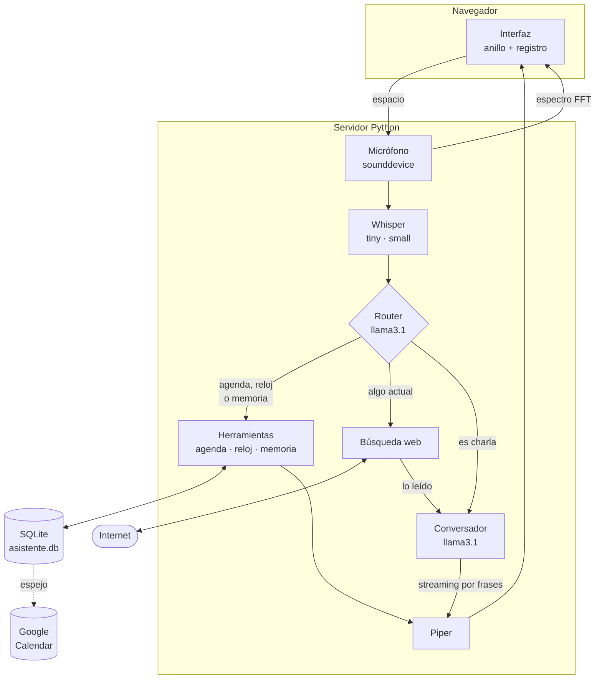

<h1 align="center">Jarvis</h1>

<p align="center">
  <strong>Asistente de voz en español. Local, privado y sin APIs de pago.</strong>
</p>

<p align="center">
  Le hablas, te entiende, te contesta con voz y te lleva la agenda.<br>
  Los modelos corren en tu ordenador; solo sale a internet si le pides
  algo que cambia, como el tiempo o un resultado.
</p>

<p align="center">
  
  
  
  
  
  
  
</p>

---

## Tabla de contenidos

- [Qué es](#qué-es)
- [Demo](#demo)
- [Características](#características)
- [Stack tecnológico](#stack-tecnológico)
- [Arquitectura](#arquitectura)
- [Cómo funciona](#cómo-funciona)
- [Conceptos clave](#conceptos-clave)
- [Decisiones de arquitectura](#decisiones-de-arquitectura)
- [Instalación](#instalación)
  - [Qué hace falta registrarse](#qué-hace-falta-registrarse-resumen)
  - [Google Calendar](#5-google-calendar-opcional)
- [Uso](#uso)
- [Estructura del proyecto](#estructura-del-proyecto)
- [Tests](#tests)
- [Limitaciones conocidas](#limitaciones-conocidas)
- [Hoja de ruta](#hoja-de-ruta)

---

## Qué es

Jarvis es un asistente de voz que corre **entero en tu máquina**. Pulsas una
tecla, hablas, y te responde en voz alta. Además lleva tu agenda: le dices
"recuérdame comprar pan mañana a las ocho" y lo apunta; al día siguiente, nada
más abrirlo, te lo cuenta él solo.

Los modelos que usa —transcripción, lenguaje y voz— se descargan una vez y
se ejecutan en tu equipo. Sin claves de API, sin cuentas y sin cuotas.

La única pieza que pide credenciales es la sincronización con Google
Calendar, y es **opcional**: sin ella todo lo demás funciona igual.

**Por qué existe:** quería un asistente que funcionara sin depender de la nube,
y aprender por el camino cómo se ensambla de verdad una tubería de voz: dónde
están las latencias, qué se le puede confiar a un modelo y qué no.

---

## Demo

> [!NOTE]
> Sustituye esto por un GIF o un vídeo corto del asistente funcionando.
> Es lo primero que mira quien entra al repositorio.

```
Tú     ▸ "Recuérdame sacar la basura mañana a las ocho y media"
Jarvis ▸ "Apuntado: sacar la basura, mañana a las 8 y media de la mañana."

Tú     ▸ "¿Qué tengo que hacer entre las dos y las cinco de la tarde?"
Jarvis ▸ "Entre las 2 y las 5 de la tarde tienes: comer con Ana a las 2 de
          la tarde; dentista a las 5 de la tarde."

Tú     ▸ "¿Quién pintó Las Meninas?"
Jarvis ▸ "Fue Velázquez. Es su obra más famosa."
```

---

## Características

| | |
|---|---|
| 🎙️ **Voz a voz** | Grabas, transcribe, piensa y responde hablando |
| 🔒 **Modelos en local** | Voz, texto y razonamiento en tu equipo. Sin claves ni cuentas |
| 🌐 **Busca cuando hace falta** | Solo sale a internet si preguntas algo actual |
| 🧠 **Te recuerda** | Tu nombre, dónde vives, a qué te dedicas |
| 📅 **Agenda real** | Las tareas van a SQLite, no a la memoria del modelo |
| 🗣️ **Voz neuronal** | Piper, no la voz robótica del sistema |
| ✋ **Interrumpible** | Pulsa espacio mientras habla y calla en el acto |
| 📊 **Interfaz reactiva** | El anillo responde al espectro real de tu voz |
| 🌅 **Resumen al entrar** | Te cuenta lo de hoy y lo atrasado sin que preguntes |
| ⚡ **Streaming** | Empieza a hablar en cuanto tiene la primera frase |

---

## Stack tecnológico

| Etapa | Herramienta | Modelo | Por qué |
|---|---|---|---|
| **Transcripción** | [faster-whisper](https://github.com/SYSTRAN/faster-whisper) 1.2 | `tiny` + `small` | `tiny` para el texto en vivo, `small` para la versión buena |
| **Razonamiento** | [Ollama](https://ollama.com) 0.6 | `llama3.1:8b` | Sin razonamiento explícito, buen *tool calling* en español |
| **Síntesis de voz** | [Piper](https://github.com/OHF-Voice/piper1-gpl) 1.7 | `es_ES-sharvard-medium` | Voz neuronal, x19 tiempo real |
| **Servidor** | FastAPI + WebSocket | — | Comunicación bidireccional con la interfaz |
| **Memoria** | SQLite | — | Lo que debe ser exacto no lo guarda un modelo |
| **Búsqueda** | DuckDuckGo vía [`ddgs`](https://pypi.org/project/ddgs/) | — | Sin clave de API |
| **Calendario** | Google Calendar API (opcional) | — | Espejo de las tareas; SQLite sigue mandando |
| **Interfaz** | HTML + [Three.js](https://threejs.org) servido en local | — | Sin CDN: funciona sin conexión |

**Requisitos:** Python 3.13, GPU NVIDIA con 8 GB de VRAM (probado en RTX 3060 Ti),
16 GB de RAM. Funciona en CPU, pero mucho más lento.

---

## Arquitectura

La decisión de fondo: **no un modelo de voz a voz, sino cuatro etapas
independientes**. Cada pieza se puede medir, cambiar y depurar por separado.



**La regla que no se rompe:** lo que debe ser exacto nunca lo decide el modelo.
El modelo elige *qué función llamar*; la fecha, la hora y el texto de la tarea
los calcula código determinista y se guardan literales.

---

## Cómo funciona

### El ciclo de un turno

1. **Pulsas espacio.** El navegador manda `{"cmd": "alternar"}` por WebSocket.
   El servidor abre el micrófono con `sounddevice`.

2. **Mientras hablas** pasan dos cosas en paralelo: cada 50 ms se envía el
   espectro del audio para que el anillo reaccione, y cada 900 ms el modelo
   `tiny` transcribe los últimos 15 segundos para mostrar el texto en vivo.

3. **Pulsas espacio otra vez.** Se cierra el micrófono y el modelo `small`
   transcribe el audio completo con `beam_size=5`.

4. **El router decide.** Una primera llamada al LLM, con las herramientas
   conectadas y un prompt seco, responde a una sola pregunta: ¿esto va de la
   agenda o del reloj?

5. **Según la respuesta:**
   - **Sí** → se ejecuta la herramienta. El resultado ya viene redactado desde
     SQLite y se lee tal cual, sin pasar por el modelo: una hora no puede
     cambiar por el camino.
   - **No** → segunda llamada, esta vez **sin herramientas**, con el prompt
     conversacional. Se transmite en streaming y cada frase completa se manda
     a la voz sin esperar al resto.

6. **Piper sintetiza** y `sounddevice` reproduce por trozos, comprobando entre
   uno y otro si has pulsado espacio para interrumpir.

### Al conectar

Nada más abrir la página, Jarvis mira la base de datos y, si hay algo, lo
cuenta sin que preguntes:

> *"Buenos días. Hoy tienes: gimnasio a las 7 de la mañana; dentista a las 5
> de la tarde. Y se te pasó llamar al banco."*

Distingue lo de hoy, lo atrasado y lo que no tiene fecha. Si no hay nada, calla.

---

## Conceptos clave

### Router y conversador separados

Enchufar las herramientas al asistente principal **le estropea la
conversación**. Deja de ser un asistente y se cree un menú de funciones:

```
Usuario ▸ "Cuéntame un chiste"
Modelo  ▸ "No tengo una función específica para contar chistes."
```

La solución no es un prompt mejor: se probaron tres y ninguno lo arregló del
todo. Son **dos llamadas con dos personalidades** — un router seco que solo
enruta, y un conversador que nunca ve las herramientas y por eso nunca habla
de ellas.

### El modelo propone, el código dispone

Un modelo de 8B se equivoca al enrutar. Lo hace poco, pero lo hace, y apuntar
una tarea es lo único que deja rastro permanente. Por eso hay un **guardia
determinista**: una pregunta nunca crea una tarea, salvo que lleve un verbo de
encargo.

```
"¿Qué tal has pasado el día?"     → conversación   (pregunta, sin encargo)
"¿Me apuntas comprar pan?"         → anadir_tarea   (pregunta, con encargo)
"Dentista el jueves a las cinco"   → anadir_tarea   (no es pregunta)
```

Sin el guardia: **5 de 10**. Con él: **17 de 18**.

Se probó también un guardia más estricto —exigir un verbo de acción— y
**rompía tres formas naturales** de apuntar cosas ("Dentista el jueves a las
cinco", "Reunión mañana a las diez", "Cita con el médico el viernes"). Se
descartó: el falso positivo que quedaba costaba menos que perder esas tres.

### Interpretar el tiempo como lo hace una persona

Las fechas no las decide el modelo. Las calcula [`memoria.py`](memoria.py) con
un intérprete propio y 82 casos de test.

Lo interesante son las ambigüedades del español hablado:

| Dices (a las 20:15) | Entiende | Por qué |
|---|---|---|
| "a las 8.40" | hoy 20:40 | Las 8:40 ya pasaron; es la próxima vez que serán las 8:40 |
| "a las 8.40 de la mañana" | mañana 08:40 | Lo dijiste explícito: manda tu palabra |
| "el jueves a las 5" | jueves 17:00 | Nadie va al dentista a las cinco de la madrugada |
| "mañana" | día siguiente | |
| "mañana por la mañana" | día siguiente, 09:00 | La misma palabra, dos significados |
| "entre las 2 y las 5 de la tarde" | 14:00–17:00 | La franja se aplica a **las dos** horas |
| "en media hora" | +30 min | |

### Ventanas, no solo días

Preguntar por un **día** y por un **rato** son cosas distintas:

```
"¿qué tengo mañana?"                → 00:00 a 23:59
"¿qué tengo mañana por la tarde?"   → 13:00 a 20:59
"¿qué tengo en 30 minutos?"         → de ahora a +30 min
"¿qué tengo entre las 2 y las 5?"   → 14:00 a 17:00
```

### El espectro, no el volumen

El anillo de la interfaz no reacciona a un nivel de volumen sino al **espectro
real** de tu voz: 32 bandas logarítmicas calculadas por FFT en el servidor y
enviadas 20 veces por segundo. Cada marca responde a una zona de frecuencia,
así que se ve la forma de la voz en lugar de un latido uniforme.

Cuando habla Jarvis no hay audio de entrada, así que la forma se genera en el
navegador combinando tres ritmos —sílaba, palabra y frase— porque un pulso
regular se nota falso al instante.

---

## Decisiones de arquitectura

> Esta sección documenta **por qué** cada pieza es la que es. Casi todas las
> decisiones vienen de una medición, no de una intuición.

### Por qué `llama3.1:8b` y no un modelo de razonamiento

Se empezó con `qwen3:4b`. No sirve para voz, y no hay forma de arreglarlo:

| Configuración | Qué pasa | Primer token |
|---|---|---|
| `think=False` | El razonamiento se vuelca **dentro** del texto normal: 3.256 caracteres de *"Okay, the user asked… Let me break this down"* que se leerían en voz alta | 0,2 s |
| `think=True` | Separa bien el razonamiento, pero se pasa 32 segundos pensando antes de decir la primera palabra | **32,5 s** |

`think=False` no apaga el razonamiento: solo hace que Ollama **deje de
separarlo**. Es peor que no ponerlo.

`llama3.1:8b` responde en **0,7 s** y no razona en voz alta.

### El detalle que costaba 14x

Las dos llamadas al modelo —router y conversador— **deben usar el mismo
`num_ctx`**. Si cambia, Ollama recarga el modelo entero en cada turno:

| | Coste por pregunta |
|---|---|
| `num_ctx` distinto (2048 / 4096) | **17,3 s** |
| `num_ctx` igual (4096 / 4096) | **1,2 s** |

Catorce veces más rápido por un parámetro que parecía inocente. Es la clase de
cosa que no aparece en la documentación y solo se ve midiendo.

### Por qué un intérprete de fechas propio

Se evaluó [`dateparser`](https://github.com/scrapinghub/dateparser), la
biblioteca estándar para esto. Falla en lo más común del español hablado:

| Entrada | `dateparser` |
|---|---|
| `"el jueves"` | ❌ No lo entiende (el artículo lo rompe) |
| `"pasado mañana"` | ❌ No lo entiende |
| `"esta tarde"` | ❌ No lo entiende |
| `"mañana a las 8"` | ⚠️ Acierta el día, **se come la hora** |

Un intérprete propio son unas 150 líneas y se comporta de forma predecible.
Para algo que debe ser exacto, es la elección correcta.

### Por qué Piper y no la voz del sistema

Tres motores probados, en este orden:

| Motor | Resultado |
|---|---|
| `pyttsx3` | **Solo suena la primera frase.** A partir de la segunda, `runAndWait()` vuelve en 0,1 s sin emitir sonido. Pasa igual creando el motor en cada frase que reutilizando uno solo |
| SAPI directo (`win32com`) | Funciona, 5/5 frases. Pero es una voz de hace veinte años y **suena a robot** |
| **Piper** | Voz neuronal, 5/5 frases, y suena a persona |

Entre las dos voces españolas *medium* de Piper, la elección también fue por
medición:

| Voz | Sintetizar 6 s de audio |
|---|---|
| `es_ES-davefx` | 1,98 s → dos segundos de silencio antes de hablar |
| **`es_ES-sharvard`** | **0,33 s** → x19 tiempo real |

### Por qué el resultado de una herramienta no pasa por el modelo

Cuando `listar_tareas` devuelve *"dentista a las 5 de la tarde"*, ese texto se
lee tal cual. Sería tentador pedirle al modelo que lo redacte más bonito, pero
entonces una hora podría cambiar por el camino. **La fluidez no compensa el
riesgo de dar mal una cita.**

Por eso [`memoria.py`](memoria.py) genera frases ya listas para leer, con las
horas en el formato en que las diría una persona:

```
20:21 → "a las 8 y 21 de la tarde"
08:45 → "a las 9 menos cuarto de la mañana"
13:00 → "a la una de la tarde"
12:00 → "al mediodía"
```

### Por qué streaming con cola en vez de esperar la respuesta

`ollama.chat(stream=True)` devuelve un generador **síncrono y bloqueante**.
Consumirlo desde el bucle de eventos lo congela. La solución es un hilo aparte
que empuja cada trozo a una `asyncio.Queue` con `call_soon_threadsafe`, que es
la única forma correcta de tocar una cola de asyncio desde fuera de su hilo.

Así Jarvis empieza a hablar en cuanto tiene la primera frase completa, sin
esperar a que el modelo termine de escribir el resto.

### Por qué el detector de fin de frase no es un simple punto

El regex evidente —`[.!?…]\s*$`— parte "a las 20.40" en dos, y la voz dice dos
frases donde había una hora. El detector real exige que después del punto haya
llegado ya un espacio, y descarta los puntos entre cifras y los de abreviatura
(*"El Sr. García"* ya no corta ahí).

### Home Assistant: evaluado y descartado

Habría ahorrado trabajo, pero el objetivo era entender la tubería completa y
tener algo propio. Se descartó a conciencia.

---

## Instalación

### Qué hace falta registrarse (resumen)

| Pieza | ¿Pide cuenta o clave? | Coste |
|---|---|---|
| Whisper (transcripción) | No | Gratis, se descarga solo |
| Ollama + llama3.1 | No | Gratis, se descarga solo |
| Piper (voz) | No | Gratis, se descarga solo |
| Búsqueda web (DuckDuckGo) | **No, sin clave de API** | Gratis |
| **Google Calendar** | **Sí, credenciales OAuth** | Gratis, pero hay que configurarlo |

Solo el calendario pide credenciales, y es **opcional**: sáltatelo y todo lo
demás sigue funcionando.

### 1. Requisitos previos

- **Python 3.13** ([descarga](https://www.python.org/downloads/))
- **[Ollama](https://ollama.com/download)**
- GPU NVIDIA con 8 GB de VRAM (opcional, pero muy recomendable)

### 2. Modelo de lenguaje

```bash
ollama pull llama3.1:8b
```

### 3. Dependencias

```bash
pip install -r requirements.txt
```

### 4. Voz

```bash
python -m piper.download_voices es_ES-sharvard-medium --data-dir voces
```

Los modelos de Whisper se descargan solos la primera vez que arranca.

### 5. Google Calendar (opcional)

Este es **el único paso que pide credenciales**. Todo lo demás funciona sin
registrarse en ningún sitio. Si te lo saltas, Jarvis va igual: las tareas se
guardan en SQLite y simplemente no aparecen en tu calendario.

#### Qué necesitas conseguir

Dos valores, y ambos son **gratis**:

| Variable | Qué es | Pinta que tiene |
|---|---|---|
| `GOOGLE_CLIENT_ID` | Identifica tu aplicación ante Google | `4214...-fhf0....apps.googleusercontent.com` |
| `GOOGLE_CLIENT_SECRET` | La contraseña de esa aplicación | `GOCSPX-...` (unos 35 caracteres) |

> [!CAUTION]
> **Una "clave de API" de Google NO sirve.** Las claves API solo acceden a
> datos públicos, y tu calendario es privado. Lo que hace falta es un
> **ID de cliente OAuth 2.0**, que es otra cosa distinta dentro de la misma
> consola. Es el error más fácil de cometer.

#### Paso a paso en la consola de Google

Todo ocurre en [console.cloud.google.com](https://console.cloud.google.com):

**1. Crea un proyecto** (o usa uno que ya tengas). El nombre da igual.

**2. Habilita la API.**
`APIs y servicios → Biblioteca` → busca *Google Calendar API* → **Habilitar**.

**3. Configura la pantalla de consentimiento.**
`Google Auth Platform → Público` (en consolas antiguas:
`Pantalla de consentimiento de OAuth`):

- Tipo de usuario: **Externo**
- Estado de publicación: **Prueba** (*Testing*)
- En **Usuarios de prueba** → **+ Añadir usuarios** → **pon tu propio Gmail**

> [!WARNING]
> Ese último punto no es opcional. Si tu correo no está en la lista de
> usuarios de prueba, Google te bloqueará con
> `Error 403: access_denied` — aunque sea tu propia aplicación y tu propia
> cuenta.

**4. Crea las credenciales.**
`Credenciales → Crear credenciales → ID de cliente de OAuth`:

- Tipo de aplicación: **Aplicación de escritorio**
  (no *Aplicación web*: los redirect URI no coincidirían)
- Al crearla, Google te enseña el **ID de cliente** y el **secreto de cliente**

#### Ponlos en el `.env`

```bash
copy .env.example .env
```

Abre `.env` y pega los dos valores:

```bash
GOOGLE_CLIENT_ID=4214....apps.googleusercontent.com
GOOGLE_CLIENT_SECRET=GOCSPX-....
GOOGLE_PROJECT_ID=el-nombre-de-tu-proyecto
```

#### Comprueba y autoriza

```bash
python comprobar_google.py
```

Valida el fichero **sin mostrar tus secretos**: solo confirma que están
presentes y con el formato correcto, y detecta el error de haber creado la
credencial como aplicación web.

```bash
python calendario.py
```

Abre tu navegador para que **tú** des permiso a tu propia cuenta. Verás un
aviso de *"Google no ha verificado esta aplicación"*: es normal para una app
en modo prueba. **Configuración avanzada → Ir a (no seguro)**.

Al terminar crea un evento de prueba mañana a las 10 para que compruebes que
llega, y te pregunta si lo borra.

#### Qué se guarda dónde

| Fichero | Contiene | ¿Se sube a git? |
|---|---|---|
| `.env` | Tu client_id y client_secret | ❌ Nunca |
| `token.json` | El permiso concedido, se crea solo | ❌ Nunca |
| `.env.example` | La plantilla con huecos | ✅ Sí |

> [!WARNING]
> `.env` y `token.json` dan acceso a tu calendario. Están en `.gitignore`,
> pero si alguna vez los subes por error, **borrarlos después no basta**:
> quedan en el historial de git. En ese caso hay que **revocar el secreto**
> en la consola de Google y generar otro.

#### Si algo falla

| Error | Causa | Solución |
|---|---|---|
| `403: access_denied` | Tu correo no está en usuarios de prueba | Añádelo en `Público → Usuarios de prueba` |
| `no parece OAuth` | Creaste una clave de API, no un ID de cliente | Crea un *ID de cliente OAuth* de escritorio |
| `redirect_uri_mismatch` | Elegiste *Aplicación web* | Crea otra de tipo *Aplicación de escritorio* |
| `calendario: desactivado` | Falta el `.env` o está sin rellenar | `python comprobar_google.py` te dice qué falta |
| `sin permiso todavía` | El `.env` está bien pero falta autorizar | `python calendario.py` |

> [!IMPORTANT]
> En Windows, `faster-whisper` necesita las librerías CUDA de NVIDIA
> (`nvidia-cublas-cu12` y `nvidia-cudnn-cu12`, ya incluidas en
> `requirements.txt`). El servidor las registra en el `PATH` del proceso al
> arrancar. Sin ese paso el modelo **se carga bien en CUDA y luego revienta al
> transcribir** con `Library cublas64_12.dll is not found or cannot be loaded`.

### 6. Arrancar

```bash
python servidor.py
```

Abre <http://localhost:8000>. Deberías ver en la terminal:

```
Cargando modelos de voz...
  tiny: GPU (cuda)
  small: GPU (cuda)
Listo.
  voz: piper
```

Si en lugar de `GPU (cuda)` pone `CPU`, la línea te dice exactamente por qué.

---

## Uso

| Acción | Cómo |
|---|---|
| Hablar | `espacio` para empezar, `espacio` para enviar |
| Interrumpirle | `espacio` mientras habla |
| Ver la agenda | `python ver_tareas.py` |
| Ver también las hechas | `python ver_tareas.py --todas` |
| Vaciar la agenda | `python ver_tareas.py --borrar` |

### Qué le puedes decir

```
Agenda      "Recuérdame comprar pan mañana a las ocho"
            "Apunta que tengo dentista el jueves a las cinco"
            "¿Qué tengo que hacer hoy?"
            "¿Qué tengo mañana por la tarde?"
            "¿Qué tengo entre las dos y las cinco?"
            "¿Qué tengo en media hora?"
            "Ya he comprado el pan"

Reloj       "¿Qué hora es?"   "¿Qué día es hoy?"

Charla      "¿Quién pintó Las Meninas?"
            "Explícame qué es una API"
            "Cuéntame un chiste"
```

### Configuración

Todo se ajusta en la cabecera de [`servidor.py`](servidor.py):

```python
MODELO_LLM       = "llama3.1:8b"            # modelo de Ollama
MODELO_BUENO     = "small"                  # Whisper de la pasada final
VOZ_PIPER        = "es_ES-sharvard-medium"  # voz
VELOCIDAD_VOZ    = 1.0                      # >1 más lento, <1 más rápido
TEMPERATURA      = 0.35                     # a 0.8 se inventaba datos
NUM_CTX          = 4096                     # ojo: igual en las dos llamadas
MAX_GRABACION_S  = 30                       # corte automático
```

---

## Estructura del proyecto

```
├── servidor.py            # FastAPI, WebSocket, router, herramientas, voz
├── memoria.py             # SQLite + intérprete de fechas en español
├── buscar.py              # Búsqueda web y lectura de páginas
├── calendario.py          # Espejo en Google Calendar (opcional)
├── index.html             # Interfaz
├── static/nucleo.js       # Núcleo 3D con Three.js
├── ver_tareas.py          # Utilidad de consola para la agenda
├── comprobar_google.py    # Valida el .env sin mostrar los secretos
├── requirements.txt
├── .env.example           # Plantilla de credenciales, sin secretos
│
├── eval_router.py         # Acierto del router              (56 frases)
├── test_memoria.py        # Fechas y horas habladas         (37 casos)
├── test_ventanas.py       # Franjas y tramos horarios       (25 casos)
├── test_horas.py          # Ambigüedad de "a las 8.40"      (20 casos)
├── test_voz.py            # Piper: suena, corta, pronuncia   (7 casos)
├── test_frases.py         # Troceado para la voz             (6 casos)
├── test_resumen.py        # Persistencia entre días          (4 casos)
├── test_cadena.py         # Las cuatro etapas de una vez
│
├── voces/                 # Modelos de Piper (se descargan)
├── .env                   # TUS SECRETOS: nunca se sube
├── token.json             # Acceso a tu calendario: nunca se sube
└── asistente.db           # Tus tareas: nunca se sube
```

---

## Tests

```bash
python test_memoria.py    # interpretación de fechas y horas
python test_horas.py      # desambiguación con el reloj
python test_ventanas.py   # franjas del día y tramos
python test_resumen.py    # persistencia y resumen diario
python test_frases.py     # troceado de frases para la voz
python test_voz.py        # síntesis, interrupción, pronunciación
python eval_router.py     # acierto del router sobre 42 frases
```

**99 casos** sobre la lógica que de verdad puede romperse en silencio: el
intérprete de fechas, el troceado de frases y el motor de voz.

Los tests de fecha **fijan el "ahora"** en un lunes concreto en vez de usar el
reloj del sistema, así que comprueban de verdad qué pasa al día siguiente sin
esperar veinticuatro horas:

```python
AHORA = datetime(2026, 8, 31, 20, 15)      # lunes por la noche
caso(AHORA, "a las 8.40", "31/08 20:40")   # hoy por la noche, no mañana
```

`test_voz.py` no puede *oír*, así que comprueba lo medible: que suena varias
veces seguidas, que dura lo que debe, que se corta al interrumpir, y —leyendo
los fonemas que genera Piper— que los números se pronuncian como palabras
(`"5"` → `θˈinko`).

---

## Limitaciones conocidas

- **Solo desde el PC.** El micrófono lo captura Python, no el navegador, así
  que abrirlo desde el móvil no serviría. Moverlo al navegador exige HTTPS
  (`getUserMedia` no funciona sobre `http://`).
- **Hay que pulsar dos veces.** No hay corte automático por silencio todavía.
- **No avisa solo.** Si tienes algo a las 20:30, a las 20:30 no pasa nada:
  tienes que preguntar tú o abrir la página.
- **La búsqueda web usa fragmentos de resultados**, no lee las páginas
  enteras. Para una clasificación funciona; para el tiempo suele
  devolver enlaces en vez del dato.
- **La VRAM va justa.** Whisper y el modelo comparten 8 GB. Con un LLM más
  grande habría que bajar Whisper a CPU.
- **Horas en letra.** "A las ocho cuarenta" no se interpreta; en cifras sí, y
  Whisper casi siempre transcribe los números como cifras.
- **`host="0.0.0.0"`** expone el servidor a la red local. Cámbialo a
  `127.0.0.1` si eso te preocupa.

---

## Hoja de ruta

- [x] Tubería voz a voz con streaming
- [x] Agenda persistente con herramientas
- [x] Intérprete de fechas en español
- [x] Voz neuronal con Piper
- [x] Interrupción a media frase
- [ ] Corte automático por silencio (VAD con Silero)
- [x] Búsqueda web sin claves de API
- [ ] Captura de audio en el navegador (habilita el móvil)
- [x] Set de evaluación del router con porcentaje de acierto
- [ ] `docker compose up`
- [ ] Abstracción `LLMProvider` para comparar local contra nube

---

## Licencia

> [!NOTE]
> Añade aquí tu licencia. [MIT](https://choosealicense.com/licenses/mit/) es
> la opción habitual para un proyecto así.

---

<p align="center">
  <sub>Construido con modelos que caben en una GPU de escritorio.</sub>
</p>
